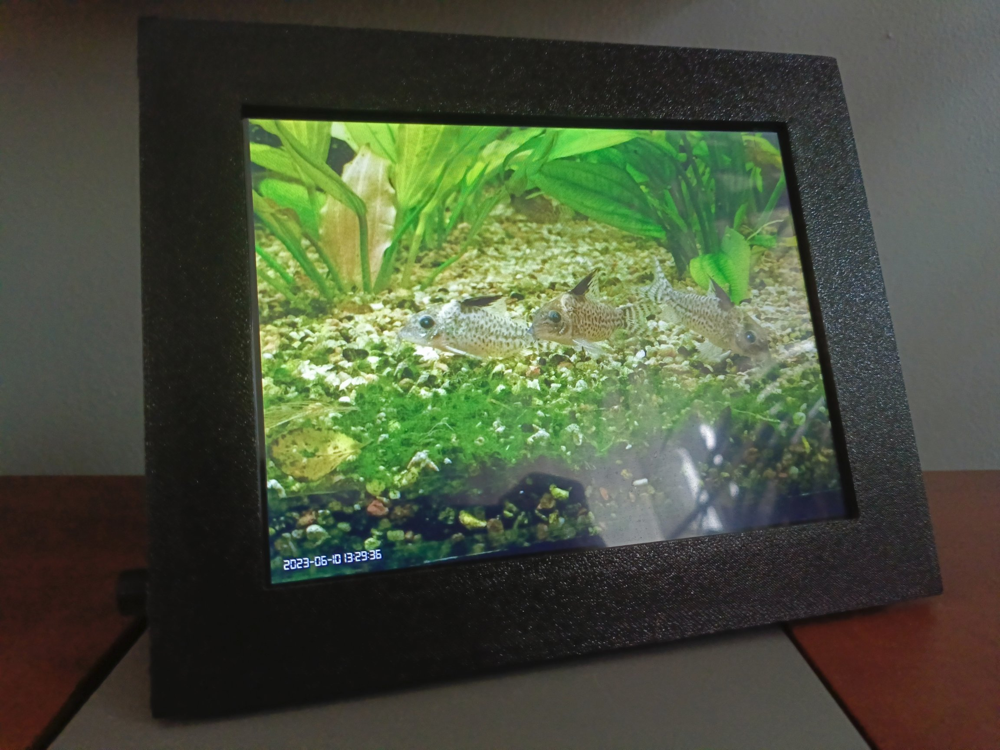
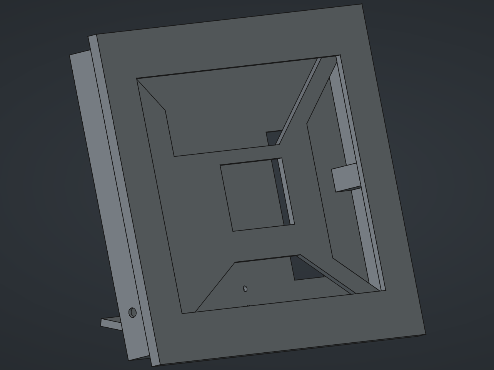
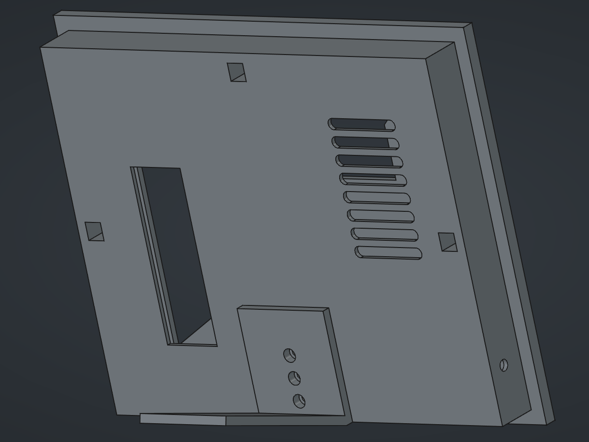

# Simple Digital Image Frame

A lightweight and efficient image slideshow program written in Rust, designed to power digital image frames, particularly those built around the Raspberry Pi Zero 2W. It continuously displays a curated collection of images for a configurable duration.

## Key Features:

-   **Asynchronous Image Loading**: Ensures smooth transitions and responsive performance by loading upcoming images in the background.
-   **Intelligent Image Scaling**: Automatically adjusts image resolution to match the display, optimizing performance for devices with limited graphical capabilities.
-   **EXIF-based Auto-Rotation**: Automatically corrects image orientation using embedded EXIF metadata.
-   **EXIF Timestamp Display**: Optionally overlays photo capture dates and times extracted from EXIF data directly onto the image.
-   **Configurable Display Duration**: Allows users to set the time each image is displayed before transitioning to the next.
-   **Total Slideshow Duration**: Define an overall runtime for the slideshow, perfect for timed exhibitions or events.
-   **Low Resource Footprint**: Developed in Rust, the application is optimized for minimal CPU and memory usage, making it ideal for embedded systems like the Raspberry Pi.



## Usage

The program is configured via command-line arguments.
```
Usage: simple-image-frame [OPTIONS] --pictures-list <PICTURES_LIST>...

Options:
  -d, --display-time <DISPLAY_TIME>       Time between photos [default: 20]
  -f, --full-time <FULL_TIME>             Full time of the slideshow [default: 5400]
  -p, --pictures-list <PICTURES_LIST>...  List of the pictures
      --hide-timestamp                    Hide photo timestamp
  -h, --help                              Print help
  -V, --version                           Print version
```

## Cross building

Due to the fact, that compiling on low end devices might take sunstantial amount of time, you can cross build it on dekstop. To build for aarch64 arhitecure, install aarch64-linux-gnu-glibc dependency and build with provided command:
```
CARGO_TARGET_AARCH64_UNKNOWN_LINUX_GNU_LINKER=aarch64-linux-gnu-gcc cargo build --release --target aarch64-unknown-linux-gnu
```
# Physical image frame project

Provided STL project can be altered to suit your needs and selection of hardware. Below is the list of parts used to create example for this project:
 - Any Rust compatible hardware, in this example Raspberry Pi Zero 2W
 - 8-inch HDMI LCD display, 4x3 aspect ratio prefered
 - 3D printer to print case
 - Externaly powered USB HUB and power supply

# STL Model

Case consists of several parts: front frame, back frame, inside frame and leg.

